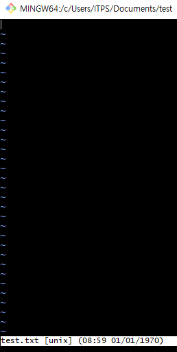

***01-4 빔 편집기.md***
# 빔 편집기에서 텍스트 문서 만들기 👓
- 터미널에서 사용할 수 있는 편집기 중에 대표적인 것이 리눅스의 기본 편집기인 빔(Vim)입니다.
**빔이란**
- 깃의 기능을 배우고 익히는 데 집중하기 위해 복잡하고 긴 소스 코드 대신에 간단한 텍스트가 담긴 파일로 실습할 것입니다. 자주 사용하는 텍스트 편집기가 바로 빔입니다.

**빔에서 문서 작성하고 저장하기**
1. Documents 디렉토리로 이동한 후 test 디렉토리를 만들고 test 디렉토리로 이동합니다.
```bash
$ cd Documents
$ mkdir test
$ cd test
```
2. test.txt 파일을 만든다. 같은 파일이 없다면 그 이름으로 만들고 같은 파일이 있다면 그 파일을 엽니다.
```bash
$ vim test.txt
```
3. 마크 다운에서 이미지 넣기
```
[대체 텍스트](이미지 경로)
```


4. 빔에는 문서를 작성하는 '입력 모드'와 문서를 저장하는 'ex모드'가 있습니다. 빔은 처음에 'ex 모드'로 열린다.
5. 빔 편집기에서 텍스트를 입력하면 ex 모드 상태에서 I 또는 A를 눌러서 입력 모드 상태로 바꿔야 합니다. 입력 모드 상태가 되면 화면 맨 아래 'INSERT' 또는 '끼워넣기'라는 단어가 뜹니다.
6. 파일을 저장하려면 다시 ex모드로 돌아가야 합니다. 입력모드에서 ex모드로 돌아가려면 ESC를 누르세요. 그리고 ':'입력하고 뒤에 'wq'라고 명령을 입력한 후 Enter를 누르세요. :wq 명령은 저장한 후 종료하라는 뜻입니다.
7. Enter를 누르면 작성한 파일이 저장되고 편집기가 종료되면서 빔 편집기를 시작했던 터미널 창으로 되돌아갑니다.

**빔의 ex모드 명령**

명령|설명
---|---
:w 또는 :wrtie | 편집하던 문서를 저장합니다.
:q 또는 :quit | 편집기를 종료합니다.
:wq | 편집하던 문서를 저장하고 종료합니다.
:q! | 편집하던 문서를 저장하지 않고 편집기를 종료합니다. 확장자가 .swp인 임시 파일이 생깁니다.
:wq 파일명 | 편집하던 문서를 지정한 파일 이름으로 저장합니다.

**cat 명령으로 텍스트 문서 확인하기**
- 터미널 창에서 텍스트 문서의 내용을 간단히 확인할 때는 리눅스의 cat 명령을 사용합니다. cat 명령 다음에 텍스트 파일 이름을 함께 사용하면 파일 내용을 보여 줍니다.
```bash
$ cat test.txt
```
**cat 명령 모음**
명령 | 기능
---|---
$ cat file | file의 내용을 화면에 표시합니다.
$ cat file(s) > Newfile | file(s)를 차례로 연결해서 새로운 파일인 NewFile을 만듭니다.
$ cat file1 >> file2 | file1의 내용을 file2의 내용 끝에 연결합니다.