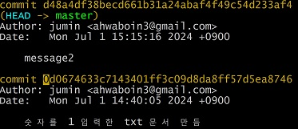

***02-3 커밋 내용 확인하기.md***
# 🏄‍♂️ 02-3 커밋 내용 확인하기
**커밋 기록 자세히 살펴보기**
- git log 명령을 입력하면 지금까지 마니든 버전이 화면에 보이고 버전마다 설명도 함께 나타납니다. 앞에서 git log 멸령을 입력했을 때 나타난 화면을 더 자세히 살펴 보겠습니다.



 - commit이라는 항복 옆에 영문과 숫자로 된 긴 문자열이 나타나는데 이것을 커밋 해시(commit hash), 또는 깃 해시(git hash)라고 합니다. 커밋을 구별하는 아이디라고 생각하면 쉽습니다.
 - 커밋 해시 옆에 있는(HEAD->main(master))는 이 버전이 가장 최신이라는 표시입니다.
 - author항목에는 버전을 누가 만들었는지, Date 항목에는 버전이 언제 만들어졌는지 나타나죠. 그 아래에는 작성자가 기록한 커밋 메시지가 나옵니다.
 - 이렇게 git log 명령을 입력했을 때 나오는 정보를 묶어 간단히 커밋 로그라고 합니다.

 **🔎변경 사항 확인하기 - git diff**
 - git diff 명령을 사용하면 작업 트리에 있는 파일과 스테이지에 있는 파일을 비교하거나, 스테이지에 있는 파일과 저장소에 있는 최신 커밋을 비교해서 수정한 파일을 커밋하기 전에 최종 검토할 수 있습니다.

 1. 빔에서 hello.txt파일을 열고 기존 내용 중에서 2를 지우고 two를 추가한 후 저장하세요.
 ```
 $ vim hello.txt
 ```
 2. git status 명령을 사용해 깃의 상태를 확인해 보면 hello.txt 파일이 수정되었고, 아직 스테이징 상태가 아니라고 나옵니다.
 3. 방금 수정한 hello.txt파일이 저장소에 있는 최신 버전의 hello.txt와 어떻게 다른지 확인해 볼려면 git diff 명령을 사용합니다.
 4. -2 는 최신 버전과 비교할 때 hello.txt 파일에서 2가 삭제되었다는 뜻이고, +two는 hello.txt파일에 'two'라는 내용이 추가되었다는 뜻입니다. 이렇게 작업 트리에서 수정한 파일과 최신 버전을 비교한 후 수정한 내용으로 다시 버전을 만들려면 스테이지에 올린 후 커밋하고, 수정한 내용을 버리려면 git restore명령을 사용해 취소합니다. git restore 사용법은 나중에 더 자세히 알아 봅니다.
 5. 빔에서 hello.txt파일을 열고 two부분을 숫자 2로 수정한 후 저장합니다.
